# 关于 Spring Integration 你知道多少，包含集成MQTT案例源码
适合的读者，略微了解SpringBoot、消息队列的朋友，想了解和尝试使用Spring Integration框架，想扩展知识边界。

掘金文章链接：[关于 Spring Integration 你知道多少，包含集成MQTT案例述及源码](https://juejin.cn/spost/7276678098409979939)

掘金主页：[宁在春](https://juejin.cn/user/2859142558267559/posts)

**欢迎大家关注哦**~~ 也可以一起交流
## 前言

后文案例代码：GitHub 代码 <https://github.com/ningzaichun/springboot-integration-mqtt-demo>

MQTT我想大部分朋友应该都是知道的，即使没有使用过MQTT，肯定也使用过它的兄弟们，RabbitMQ、RocketMQ和Kafka等消息队列.

但这次的主角并非是MQTT，而是 `Spring Integration` ，如果是没有怎么注意Spring官网的朋友，可能甚至都没咋听过 `Spring Integration` 框架，它是针对类似信息流的一个上层抽象，不只是MQTT，比如AMQP、MAIL都支持，贴一张官网的截图，诸如下列是都支持的。

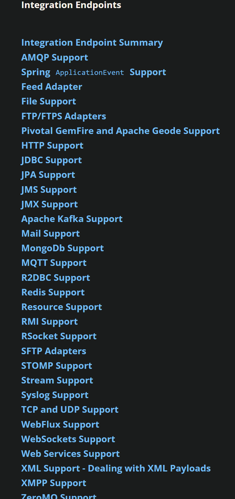

正如Spring的一贯风格，比如以前刚学Spring 的时候，肯定是学过Spring Data,知道它就是针对数据库的一系列抽象。Spring Integration 也是如此，不过抽象的对象换成了信息流罢啦。

本篇文章更多的是起一个抛转引玉的作用，虽将大致内容都涵盖在内了，但部分代码的细节，是有欠考虑的，写在前文中，还望各位见谅。

本文大纲如下：


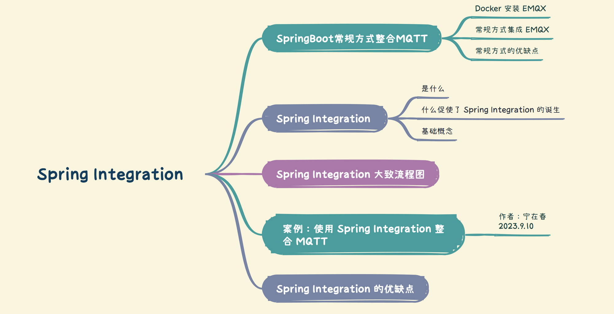

## 一、SpringBoot常规方式集成MQTT

先抛开 Spring Integration 不管，我们先看看常规的集成方式是什么的，后面再讲一讲Spring Integration 有哪些优点。

### 1.1、Docker 安装 EMQX

为了快捷，我并没有做多余的设置，直接粘贴，即可在Docker环境下，运行一个 EMQX 服务器

```bash
docker run -d --name emqx -p 1883:1883 -p 8083:8083 -p 8084:8084 -p 8883:8883 -p 18083:18083 emqx/emqx:5.1.3
```

详细可参考 [EMQX **Docker 部署指南**](https://www.emqx.io/docs/zh/v5/deploy/install-docker.html)

### 1.2、常规方式集成 EMQX

可能一些刚使用 SpringBoot 集成 EMQX（MQTT协议的服务实现）的朋友，大部分都是使用下面所阐述的方式进行整合的（在网上冲浪找的）。

偷了个小懒，下文代码示例来源：****[spring boot + mqtt 物联网开发](https://www.cnblogs.com/haoliyou/p/15157407.html)****

```java
@Slf4j
public class MqttPushClient {
 
    private static MqttClient client;
 
    public static MqttClient getClient() {
        return client;
    }
 
    public static void setClient(MqttClient client) {
        MqttPushClient.client = client;
    }
 
    private MqttConnectOptions getOption(String userName, String password, int outTime, int KeepAlive) {
        // MQTT连接设置
        MqttConnectOptions option = new MqttConnectOptions();
        // 设置是否清空session,false表示服务器会保留客户端的连接记录，true表示每次连接到服务器都以新的身份连接
        option.setCleanSession(false);
        // 设置连接的用户名
        option.setUserName(userName);
        // 设置连接的密码
        option.setPassword(password.toCharArray());
        // 设置超时时间 单位为秒
        option.setConnectionTimeout(outTime);
        // 设置会话心跳时间 单位为秒 服务器会每隔(1.5*keepTime)秒的时间向客户端发送个消息判断客户端是否在线，但这个方法并没有重连的机制
        option.setKeepAliveInterval(KeepAlive);
        // setWill方法，如果项目中需要知道客户端是否掉线可以调用该方法。设置最终端口的通知消息
        // option.setWill(topic, "close".getBytes(), 2, true);
        option.setMaxInflight(1000);
        log.info("================>>>MQTT连接认证成功<<======================");
        return option;
    }
 
    /**
     * 连接
     */
    public void connect(MqttConfig mqttConfig) {
        MqttClient client;
        try {
            String clientId = mqttConfig.getClientId();
            clientId += System.currentTimeMillis();
            client = new MqttClient(mqttConfig.getUrl(), clientId, new MemoryPersistence());
            MqttConnectOptions options = getOption(mqttConfig.getUsername(), mqttConfig.getPassword(),
                    mqttConfig.getTimeout(), mqttConfig.getKeepAlive());
            MqttPushClient.setClient(client);
            try {
                client.setCallback(new PushCallback<Object>(this, mqttConfig));
                if (!client.isConnected()) {
                    client.connect(options);
                    log.info("================>>>MQTT连接成功<<======================");
                     //订阅主题
                    subscribe(mqttConfig.getTopic(), mqttConfig.getQos());
                } else {// 这里的逻辑是如果连接不成功就重新连接
                    client.disconnect();
                    client.connect(options);
                    log.info("===================>>>MQTT断连成功<<<======================");
                }
            } catch (Exception e) {
                e.printStackTrace();
            }
        } catch (Exception e) {
            e.printStackTrace();
        }
    }
 
    /**
     * 断线重连
     *
     * @throws Exception
     */
    public Boolean reConnect() throws Exception {
        Boolean isConnected = false;
        if (null != client) {
            client.connect();
            if (client.isConnected()) {
                isConnected = true;
            }
        }
        return isConnected;
    }
 
    /**
     * 发布，默认qos为0，非持久化
     *
     * @param topic
     * @param pushMessage
     */
    public void publish(String topic, String pushMessage) {
        publish(0, false, topic, pushMessage);
    }
 
    /**
     * 发布
     *
     * @param qos
     * @param retained
     * @param topic
     * @param pushMessage
     */
    public void publish(int qos, boolean retained, String topic, String pushMessage) {
        MqttMessage message = new MqttMessage();
        message.setQos(qos);
        message.setRetained(retained);
        message.setPayload(pushMessage.getBytes());
        MqttTopic mTopic = MqttPushClient.getClient().getTopic(topic);
        if (null == mTopic) {
            log.error("===============>>>MQTT topic 不存在<<=======================");
        }
        MqttDeliveryToken token;
        try {
            token = mTopic.publish(message);
            token.waitForCompletion();
        } catch (MqttPersistenceException e) {
            e.printStackTrace();
        } catch (MqttException e) {
            e.printStackTrace();
        }
    }
 
    /**
     * 发布消息的服务质量(推荐为：2-确保消息到达一次。0-至多一次到达；1-至少一次到达，可能重复)， retained
     * 默认：false-非持久化（是指一条消息消费完，就会被删除；持久化，消费完，还会保存在服务器中，当新的订阅者出现，继续给新订阅者消费）
     *
     * @param topic
     * @param pushMessage
     */
    public void publish(int qos, String topic, String pushMessage) {
        publish(qos, false, topic, pushMessage);
    }
 
    /**
     * 订阅某个主题，qos默认为0
     *
     * @param topic
     */
    public void subscribe(String[] topic) {
        subscribe(topic, null);
    }
 
    /**
     * 订阅某个主题
     *
     * @param topic
     * @param qos
     */
    public void subscribe(String[] topic, int[] qos) {
        try {
            MqttPushClient.getClient().unsubscribe(topic);
            MqttPushClient.getClient().subscribe(topic, qos);
        } catch (MqttException e) {
            e.printStackTrace();
        }
    }
}
```

```java
@Component(value = "mqttSender")
@Slf4j
public class MqttSender {
 
    @Async
    public void send(String queueName, String msg) {
        log.debug("=====================>>>>发送主题:{},  msg:{}", queueName,msg);
        publish(2, queueName, msg);
    }
 
    /**
     * 发布，默认qos为0，非持久化
     *
     * @param topic
     * @param pushMessage
     */
    public void publish(String topic, String pushMessage) {
        publish(1, false, topic, pushMessage);
    }
 
    /**
     * 发布
     *
     * @param qos
     * @param retained
     * @param topic
     * @param pushMessage
     */
    public void publish(int qos, boolean retained, String topic, String pushMessage) {
        MqttMessage message = new MqttMessage();
        message.setQos(qos);
        message.setRetained(retained);
        message.setPayload(pushMessage.getBytes());
        MqttTopic mTopic = MqttPushClient.getClient().getTopic(topic);
        if (null == mTopic) {
            log.error("===================>>>MQTT topic 不存在<<=================");
        }
        MqttDeliveryToken token;
        try {
            token = mTopic.publish(message);
            token.waitForCompletion();
        } catch (MqttPersistenceException e) {
            log.error("============>>>publish fail", e);
            e.printStackTrace();
        } catch (MqttException e) {
            e.printStackTrace();
        }
    }
 
    /**
     * 发布消息的服务质量(推荐为：2-确保消息到达一次。0-至多一次到达；1-至少一次到达，可能重复)， retained
     * 默认：false-非持久化（是指一条消息消费完，就会被删除；持久化，消费完，还会保存在服务器中，当新的订阅者出现，继续给新订阅者消费）
     *
     * @param topic
     * @param pushMessage
     */
    public void publish(int qos, String topic, String pushMessage) {
        publish(qos, false, topic, pushMessage);
    }
 
}
```
```java
    @Slf4j
    @Component
    public class PushCallback<component> implements MqttCallback {
     
        private MqttPushClient client;
     
        private MqttConfig mqttConfiguration;
     
        @Resource
        MqttService mqttService;
     
        public PushCallback(MqttPushClient client, MqttConfig mqttConfiguration) {
            this.client = client;
            this.mqttConfiguration = mqttConfiguration;
        }
     
        @Override
        public void connectionLost(Throwable cause) {
            /** 连接丢失后，一般在这里面进行重连 **/
            if (client != null) {
                while (true) {
                    try {
                        log.info("==============》》》[MQTT] 连接丢失，尝试重连...");
                        MqttPushClient mqttPushClient = new MqttPushClient();
                        mqttPushClient.connect(mqttConfiguration);
                        if (MqttPushClient.getClient().isConnected()) {
                            log.info("=============>>重连成功");
                        }
                        break;
                    } catch (Exception e) {
                        log.error("=============>>>[MQTT] 连接断开，重连失败！<<=============");
                        continue;
                    }
                }
            }
            log.info(cause.getMessage());
        }
     
        @Override
        public void deliveryComplete(IMqttDeliveryToken token) {
            // publish后会执行到这里
            log.info("pushComplete==============>>>" + token.isComplete());
        }
     
        /**
         * 监听对应的主题消息
         *
         * @param topic
         * @param message
         * @throws Exception
         */
        @Override
        public void messageArrived(String topic, MqttMessage message) throws Exception {
            // subscribe后得到的消息会执行到这里面
            log.info("============》》接收消息主题 : " + topic);
            log.info("============》》接收消息Qos : " + message.getQos());
            log.info("============》》接收消息内容原始内容 : " + new String(message.getPayload()));
            log.info("============》》接收消息内容GB2312 : " + new String(message.getPayload(), "GB2312"));
            log.info("============》》接收消息内容UTF-8 : " + new String(message.getPayload(), "UTF-8"));
            try {
                if (topic.equals("datapoint")) {
                    MqttResponseBody mqttResponseBody = JSONUtils.jsonToBean(new String(message.getPayload(), "UTF-8"),
                            MqttResponseBody.class);
                    MqttService mqttService = SpringUtil.getBean(MqttServiceImpl.class);
                    mqttService.messageArrived(mqttResponseBody);
                } else if (topic.equals("heartbeat")) {
                    MqttResponseHeartbeat mqttResponseHeartbeat = JSONUtils
                            .jsonToBean(new String(message.getPayload(), "UTF-8"), MqttResponseHeartbeat.class);
                    MqttService mqttService = SpringUtil.getBean(MqttServiceImpl.class);
                    mqttService.messageHeartbeat(mqttResponseHeartbeat);
                }
            } catch (Exception e) {
                e.printStackTrace();
                log.info("============》》接收消息主题异常 : " + e.getMessage());
            }
        }
     
    }
```
我只抽离了部分代码（主要是订阅、处理订阅消息和发送消息部分），详细的可以点进原文看看。

这种整合方式理解起来是非常简单的，都是直接编码的，没有什么抽象的操作，业务不大的情况下，也是可以正常玩的。

### 1.3、常规方式的优缺点

优点：

1、学习成本相对较低，代码理解难度低，上手快。

2、易封装，没有其他框架的限制，自定义化程度高。

缺点：

1、业务耦合性大。较少的主题下，可能还不会有什么感觉，如果后期topic慢慢多了起来，不同的业务有不同的处理方式，你这边都要进行相应处理的时候，就麻烦起来了。要是再出现，针对同一个主题的消息，根据消息体的不同，也要进行不同的处理，就….

2、没有框架，自由度大，相对也意味着代码量相对要大一些，一些没有封装的处理，都需要自己去进行处理。

## 二、Spring Integration 的基础概念

[Spring Integration 5.5 版本文档](https://docs.spring.io/spring-integration/docs/5.5.18/reference/html/index.html)

### 2.1、是什么

Spring Integration 提供了 Spring 编程模型的扩展，**它支持基于 Spring 的应用程序内的轻量级消息传递，并支持通过声明性适配器与外部系统集成**。这些适配器提供了比 Spring 对远程处理、消息传递和调度的支持更高级别的抽象。

Spring Integration 的主要目标是**提供一个简单的模型来构建企业集成解决方案，同时保持关注点分离**，这对于生成可维护、可测试的代码至关重要。

Spring Integration 支持消息驱动的体系结构，其中控制反转适用于运行时问题，**例如何时应运行某些业务逻辑以及应将响应发送到何处。它支持消息的路由和转换，以便可以集成不同的传输和不同的数据格式，而不会影响可测试性**。换句话说，**消息传递和集成问题由框架处理。业务组件与基础设施进一步隔离**，开发人员也摆脱了复杂的集成责任。

***

也许你此刻阅读完这里，仍然会很懵，但请相信我，在你看完整篇文章之后，你会完全理解上述文字的。

### 2.2、什么促使了 Spring Integration 的诞生

Spring Integration 的动机如下：

*   提供用于实施复杂企业集成解决方案的简单模型。
*   在基于 Spring 的应用程序中促进异步、消息驱动的行为。
*   促进现有 Spring 用户直观、增量的采用。

Spring Integration 遵循以下原则：

*   组件应该松散耦合以实现模块化和可测试性。
*   该框架应该强制业务逻辑和集成逻辑之间的关注点分离。
*   扩展点本质上应该是抽象的（但在明确定义的边界内），以促进重用和可移植性。

来自官方文档。

### 2.3、基础概念

Spring Integraion 有几个比较重要的基础概念，理解完之后，看代码将会变得十分简单，此处只是抽取了常用且本文已经使用到的概念，完整的还请阅读 [Spring Integration 文档](https://docs.spring.io/spring-integration/docs/5.5.18/reference/html/overview.html#overview-endpoints)

1、`Message` 见名知意就知是我们需要发送或接收的消息。

在 `Spring Integration` 中，它由有效负载和标头组成。Payload（有效负载）可以是任何类型，Header（标头）包含常用的必需信息，例如 ID、时间戳、相关 ID 和返回地址。标头还用于在连接的传输之间传递值。


2、`Message Channel` 消息通道代表管道和过滤器架构中的“管道”。生产者将消息发送到通道，消费者从通道接收消息。

因此，**消息通道解耦了消息传递组件**，并且还为消息拦截和监视提供了便利的点。


实际框架中针对Channel 的实现有多种，后文案例中暂时只使用了点对点的 `DirectChannel` 通道。

更多Channel的实现，请查阅：**[Message Channel Implementations](https://docs.spring.io/spring-integration/docs/5.5.18/reference/html/core.html#channel-implementations)**

3、**`Message Transformer`** 消息转换器负责转换消息的内容或结构并返回修改后的消息。最常见的转换器类型可能是将消息的有效负载从一种格式转换为另一种格式（例如从 XML 转换为`java.lang.String` 或者是 `byte[]` 转为Java对象）。

比如后面案例中的一段代码：

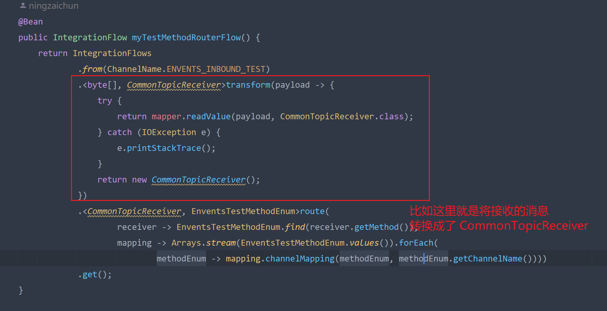

4、**`Message Router`** 消息路由器负责决定接下来应该接收该消息的一个或多个通道（如果有）。通常，消息路由（Router）可根据消息体类型（Payload Type Router）、消息头的值（Header Value Router）以及定义好的接收表（Recipient List Router）作为条件，来决定消息传递到的通道。


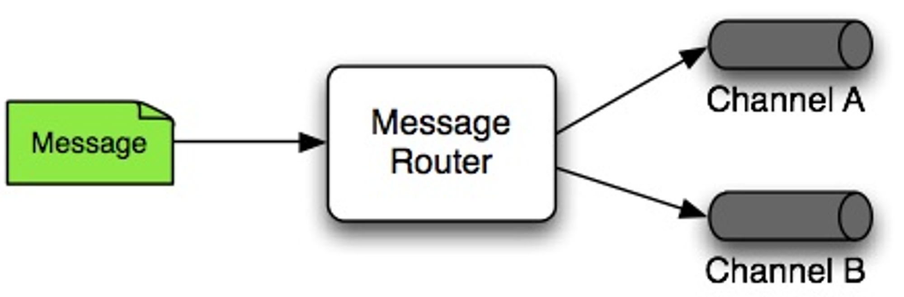
白话文就是**我们可以根据信息中的某个字段，判断这条信息，到底要被我们投递到那个通道去**。

5、`Service Activator` 服务激活器是用于将服务实例连接到消息传递系统的通用端点。**必须配置输入消息通道**，如果要调用的服务方法有返回值，还可以提供输出消息通道。

服务激活器调用某个服务对象上的操作来处理请求消息，提取请求消息的有效负载并进行转换（如果该方法不需要消息类型参数）。每当服务对象的方法返回一个值时，如果需要，该返回值同样会转换为回复消息（如果它还不是消息类型）。该回复消息被发送到输出通道。


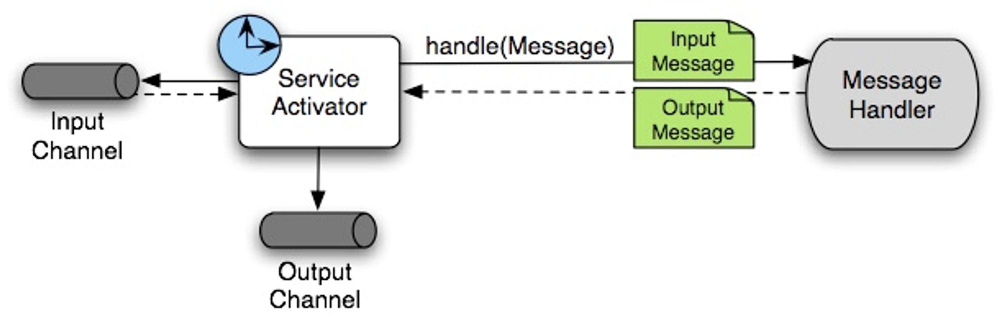
**图 4.** `Service Activator`

实际上 `Service Activator` 在代码中是一个 `@ServiceActivator()`注解，如下案例：

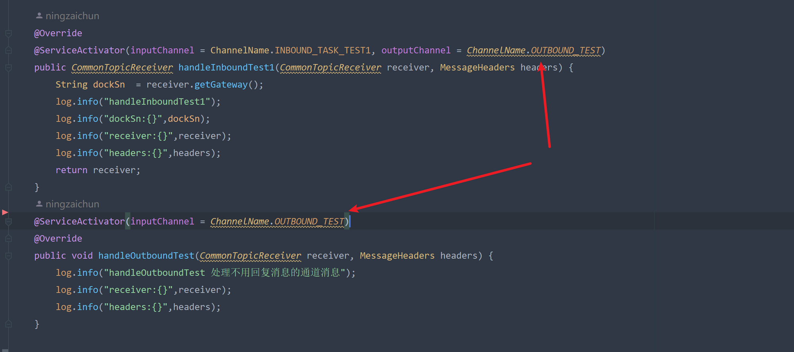
6、`Channel Adapter`通道适配器是将消息通道连接到其他系统或传输的端点。通道适配器可以是入站适配器，也可以是出站适配器。通常，通道适配器在消息与从其他系统接收或发送到其他系统的任何对象或资源（文件、HTTP 请求、JMS 消息等）之间进行一些映射。根据传输方式，通道适配器还可以填充或提取消息标头值。


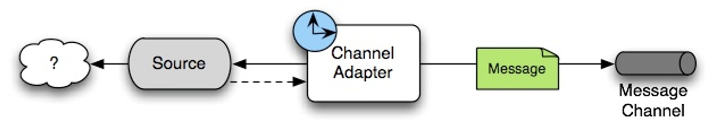
**图 5. 入站通道适配器端点将源系统连接到`MessageChannel`.**


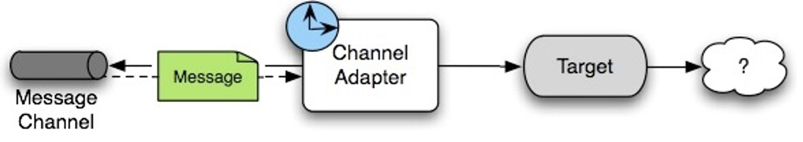
**图 6. 出站通道适配器端点将 a 连接`MessageChannel`到目标系统。**

Channel Adapter 用来连接 MessageChannel 和具体的消息端口，例如通信的 topic。

写的时候，浅浅的翻阅了下源码，大致是这三个类，等看了后面的案例，然后再看下这几个类，流程还是很容易懂的。


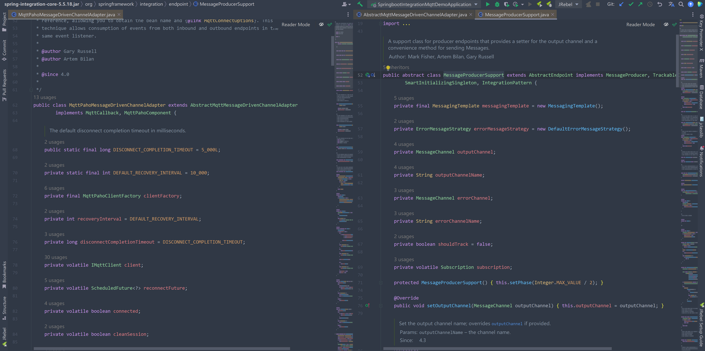
连接MQTT的代码在`MqttPahoMessageDrivenChannelAdapter.connectAndSubscribe()` 中。

只是在官方文档中，挑选了部分概念拿出来简单的讲述了一下，有很多的文字还是直接copy 的官网文档，感兴趣的话，还是更建议你去拜读官方文档，祝你能有所收获。

## 三、图：Spring Integration 案例大致流程

在讲代码之前，画了一张图，简单讲述一下大致数据流转流程是什么样的，同时也便于理解后面的代码是如何的（见谅，不好改成竖图啦）


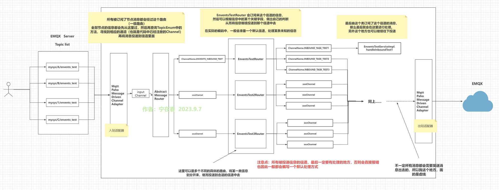
数据的大致流转过程就如上图这般，将这副图和上文中所谈及的概念，关联起来，应该能理解大部分啦。

具体的 Spring Integration 的流程图，其实远比这张图的流程要复杂（主要是牵扯到的上层抽象比较多），上图更多的是对后面的案例中的数据的一个数据流转图，让大家能更好的理解代码。

## 四、完整案例：使用 Spring Integration 整合 MQTT

代码主要借鉴于大疆官方开源项目 [（大疆的上云API的一个DEMO项目）](https://github.com/dji-sdk/DJI-Cloud-API-Demo),主体部分更是如此，可以说是弄了一个简化版，然后写下了这篇学习的博客

笔者DEMO项目地址： [springboot-integration-mqtt-demo](https://github.com/ningzaichun/springboot-integration-mqtt-demo)

### 4.1、项目结构

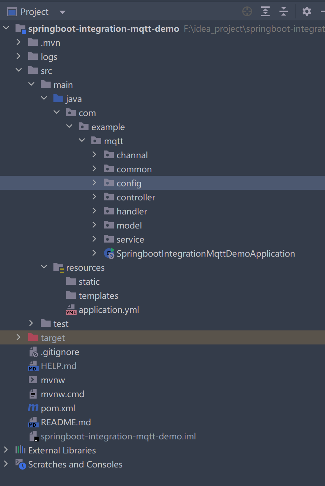
就常规项目结构，普通且简单\~

相关依赖：
```xml
    <dependency>
        <groupId>org.springframework.boot</groupId>
        <artifactId>spring-boot-starter-integration</artifactId>
    </dependency>
    <dependency>
        <groupId>org.springframework.integration</groupId>
        <artifactId>spring-integration-mqtt</artifactId>
    </dependency>
```
### 4.2、配置文件和`MqttConfiguration`

yaml配置文件：
```yaml
    server:
      port: 9876
    spring:
      application:
        name: spring-integration-mqtt-demo
    mqtt:
      # BASIC parameters are required.
      BASIC:
        protocol: MQTT
        host: 192.168.79.133
        port: 1883
        username:
        password:
        client-id: 123456
        # If the protocol is ws/wss, this value is required.
        path:
        # 在最初连接到mqtt时需要订阅的主题，多个主题用“，”分隔。
        inbound-topic: mysys/+/envents_test
      # 此部分是提供给后端生成token返回给前端，让前端使用websocket方式去和MQTT实现交互的，笔者此文的案例中并没有去实现
      DRC:
        protocol: WS
        host: 192.168.79.133
        port: 8083
        path: /mqtt

    logging:
      level:
        com.com.example.mqtt: debug
      file:
        name: logs/springboot-integration-mqtt-demo.log
```
具体的MQTT的连接参数是在红框标记的地方整合到 `MqttConnectOptions` 中的，但实际上它是采用`MqttUseEnum` 枚举的方式将yaml配置文件的参数映射到`MqttClientOptions` ，坦白说，用起来是真的舒服啊


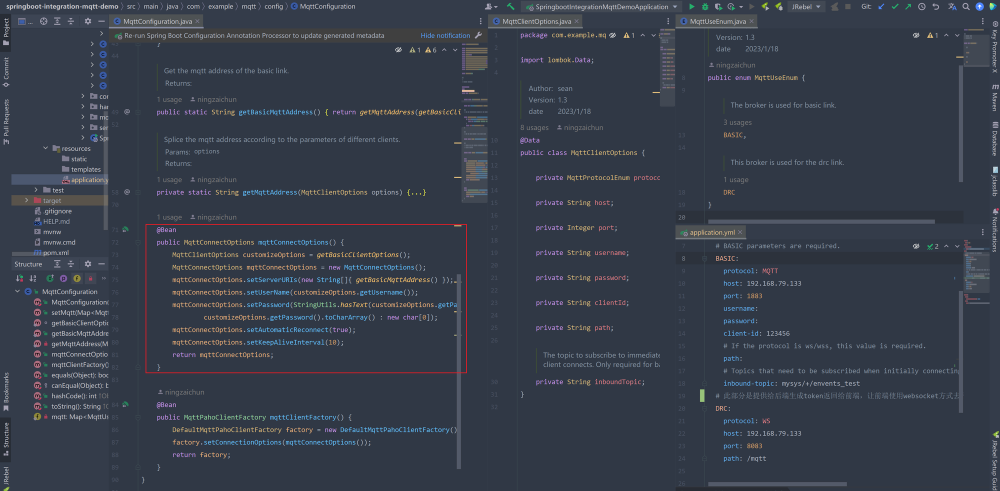
主要是两个地方：

1、一个使用枚举类来映射ymal文件，可以学习学习

2、`MqttConnectOptions` 是基础的一些设置，比如配置认证参数、设置超时时间等连接Broker的连接参数，细节可以等到使用的时候再进一步观察。

不过DRC 那部分（主要用于websocket），不过没整合到这个案例中，下次吧，下次吧。

### 4.3、`MessageChannel`

写了这么多，都忘记说了说明 MessageChannel 啦，实际上，诸如`@ServiceActivator(inputChannel = ChannelName.DEFAULT)`都是提前注册在bean当中的，否则是没法使用的。

这一点，我在前文的编写中，忘记啦。
```java
    @Configuration
    public class MqttMessageChannel {

        @Autowired
        private Executor threadPool;
        @Bean(name = ChannelName.INBOUND)
        public MessageChannel inboundChannel() {
            return new ExecutorChannel(threadPool);
        }
        @Bean(name = ChannelName.ENVENTS_INBOUND_TEST)
        public MessageChannel enventsInboundTest() {
            return new DirectChannel();
        }

        @Bean(name = ChannelName.INBOUND_TASK_TEST1)
        public MessageChannel inboundTaskTest1() {
            return new DirectChannel();
        }
        @Bean(name = ChannelName.INBOUND_TASK_TEST2)
        public MessageChannel inboundTaskTest2() {
            return new DirectChannel();
        }
        @Bean(name = ChannelName.INBOUND_TASK_TEST3)
        public MessageChannel inboundTaskTest3() {
            return new DirectChannel();
        }
    }
```
补充：`DirectChannel` 是其中的一种消息通道，是一个点对点的通道，它直接将消息分派给订阅者，同时也是最常用的通道。

Channel的具体的实现有多种，可参考官方文档：**[Message Channels](https://docs.spring.io/spring-integration/docs/5.5.18/reference/html/core.html#channel-implementations)**

### 4.4、入站适配器`MqttInboundConfiguration`
```java
    @Slf4j
    @Configuration
    @IntegrationComponentScan
    public class MqttInboundConfiguration {

        @Autowired
        private MqttPahoClientFactory mqttClientFactory;

        @Resource(name = ChannelName.INBOUND)
        private MessageChannel inboundChannel;

        /**
         * Clients of inbound message channels.
         * @return
         */
        @Bean(name = "adapter")
        public MessageProducerSupport mqttInbound() {
            MqttClientOptions options = MqttConfiguration.getBasicClientOptions();
    // 此处在初始化的时候，初始化时，默认订阅了配置文件中的已经写定的 topic
    // 如果后期有需要再增加的订阅主题，调用 addTopic() 即可
            MqttPahoMessageDrivenChannelAdapter adapter = 
    									new MqttPahoMessageDrivenChannelAdapter(
    		                options.getClientId() + "_consumer_" + System.currentTimeMillis(),
    		                mqttClientFactory, options.getInboundTopic().split(","));

            DefaultPahoMessageConverter converter = new DefaultPahoMessageConverter();
    				// use byte types uniformly
    				converter.setPayloadAsBytes(true);
    // 设置消息转换器
            adapter.setConverter(converter);
            adapter.setQos(1);
    			// 设置在接收已经订阅的主题信息后，发送给那个通道，具体的发送方法需要翻上层的抽象类
            adapter.setOutputChannel(inboundChannel);
            return adapter;
        }

        /**
         * Define a default channel to handle messages that have no effect.
         * @return
         */
        @Bean
        @ServiceActivator(inputChannel = ChannelName.DEFAULT)
        public MessageHandler defaultInboundHandler() {
            return message -> {
                log.info("The default channel does not handle messages." +
                        "\nTopic: " + message.getHeaders().get(MqttHeaders.RECEIVED_TOPIC) +
                        "\nPayload: " + message.getPayload());
            };
        }

    }
```
主要是两个地方：

1、`@IntegrationComponentScan` ，开启 Spring Integration 的注解扫描，扫描我们写的 `@ServiceActivator(inputChannel = ChannelName.DEFAULT)、``@MessagingGateway(defaultRequestChannel = ChannelName.OUTBOUND)等等`

2、`MqttPahoMessageDrivenChannelAdapter` 实现了 `MessageProducerSupport` 接口，同时也是最后的实现类。故此有较多的具体实现是在这个类中的。

### 4.5、**`Message Router`**
```java
    @Component
    @Slf4j
    public class InboundMessageRouter extends AbstractMessageRouter {

        /**
         * All mqtt broker messages will arrive here before distributing them to different channels.
         * @param message message from mqtt broker
         * @return channel
         *
         * 全部节点的信息都会先从这里过，然后再查询TopicEnum中的方法，寻找到相应的通道（也就是代码中已经注册的Channel）
         * 举个例子：就比如我现在使用MQTTX向 mysys/envents_test （broker）发送一个消息
         * 首先会经过这里，然后我们根据 mysys/envents_test 在 TopicEnum.find(topic) 寻找，
         * 找到相应的通道为：STATE_ENVENTS(Pattern.compile("^"+MY_BASIC_PRE+ENVENTS_TEST+"$"), ChannelName.ENVENTS_INBOUND_TEST),
         * 即找到一个 ChannelName 为 ENVENTS_INBOUND_TEST 通道（这个通道我们已经注册在Spring 中啦）
         *
         * 找到这个通道后，我们会将消息投递到这个通道去
         * 接下来就是看是谁订阅了这个通道的消息，那么就会接着处理这个消息
         * 比如我们的案例中是由 EnventsTestRouter 这个二级路由订阅了消息通道，来进行消息的再次分发，
         * 在这里的时候，EnventsTestRouter 可以不再是根据节点的名称来进行处理，而是具体的消息来进行二次处理，比如指定要判断消息中的某一个字段是什么
         * 从而再交由谁处理（即再次投递到哪个 ChannelName 中去）
         *
         */
        @Override
        @Router(inputChannel = ChannelName.INBOUND)
        protected Collection<MessageChannel> determineTargetChannels(Message<?> message) {
            MessageHeaders headers = message.getHeaders();
            String topic = headers.get(MqttHeaders.RECEIVED_TOPIC).toString();
            byte[] payload = (byte[])message.getPayload();
            log.info("received topic :{} \t payload :{}", topic, new String(payload));
            TopicEnum topicEnum = TopicEnum.find(topic);
            MessageChannel bean = (MessageChannel) SpringBeanUtils.getBean(topicEnum.getBeanName());
            return Collections.singleton(bean);
        }
    }
```
补充：所有的入站信息，都会率先经过这里。determineTargetChannels的实际作用并非是分发，而是找到需要接收的Channel（信道），具体的调用是在上层的抽象类 `AbstractMessageRouter.handleMessageInternal` 方法内，具体的分发也是在这个方法的下半部分。

### 4.6、IntegrationFlow Java DSL
```java
    @Bean
    public IntegrationFlow myTestMethodRouterFlow() {
        return IntegrationFlows
                .from(ChannelName.ENVENTS_INBOUND_TEST)
                .<byte[], CommonTopicReceiver>transform(payload -> {
                    try {
                        return mapper.readValue(payload, CommonTopicReceiver.class);
                    } catch (IOException e) {
                        e.printStackTrace();
                    }
                    return new CommonTopicReceiver();
                })
                .<CommonTopicReceiver, EnventsTestMethodEnum>route(
                        receiver -> EnventsTestMethodEnum.find(receiver.getMethod()),
                        mapping -> Arrays.stream(EnventsTestMethodEnum.values()).forEach(
                                methodEnum -> mapping.channelMapping(methodEnum, methodEnum.getChannelName())))
                .get();
    }
```
具体的API使用，我没有牵扯太多，简单的说一下方法：

1、form()，接收来自 ChannelName.ENVENTS\_INBOUND\_TEST 通道的消息

2、transform()，将接收的消息转换自己需要的类型，我这里是将 byte\[]转换为 CommonTopicReceiver 类型

3、route()，这个方法，怎么说，坦白说我自己也想了蛮久的，源码也看了，网上资料也查了，大部分都没有解答我的疑惑。我先说作用：这是一个消息路由器。路由器根据输入消息的内容选择一个输出通道，这个选择是通过\*\*`.route`\*\*方法来完成的。

疑惑的点在哪里呢？
```java
<CommonTopicReceiver, EnventsTestMethodEnum>route(
                    receiver -> EnventsTestMethodEnum.find(receiver.getMethod()),
                    mapping -> Arrays.stream(EnventsTestMethodEnum.values()).forEach(
                            methodEnum -> mapping.channelMapping(methodEnum, methodEnum.getChannelName())));
```
有没有人注意到`route()`方法的第二个参数 `mapping` 话说，这个 `mapping` 是怎么来的？我也没有定义。正确方法：问GPT（手头狗头）

第一遍解释：

`.route(...)` ：这是整个代码片段中最复杂的部分，它定义了一个消息路由器。路由器根据输入消息的内容选择一个输出通道，这个选择是通过\*\*`.route`\*\*方法来完成的。

*   **`receiver -> EnventsTestMethodEnum.find(receiver.getMethod())`** ：这个表达式是一个Lambda表达式，它接受一个\*\*`CommonTopicReceiver`**对象作为输入，并根据该对象的方法（** `getMethod()` **）返回一个**`EnventsTestMethodEnum`\*\*枚举值。它的作用是决定消息应该被路由到哪个通道。
*   **`mapping -> Arrays.stream(EnventsTestMethodEnum.values()).forEach(...)`** ：这个表达式也是一个Lambda表达式，它接受一个\*\*`mapping`**参数，该参数用于定义路由规则。在这里，它遍历了所有的**`EnventsTestMethodEnum`**枚举值，然后通过**`.channelMapping()`\*\*方法将每个枚举值映射到相应的输出通道。

看完还是不理解，然后我又拆出来，单独询问了一遍：

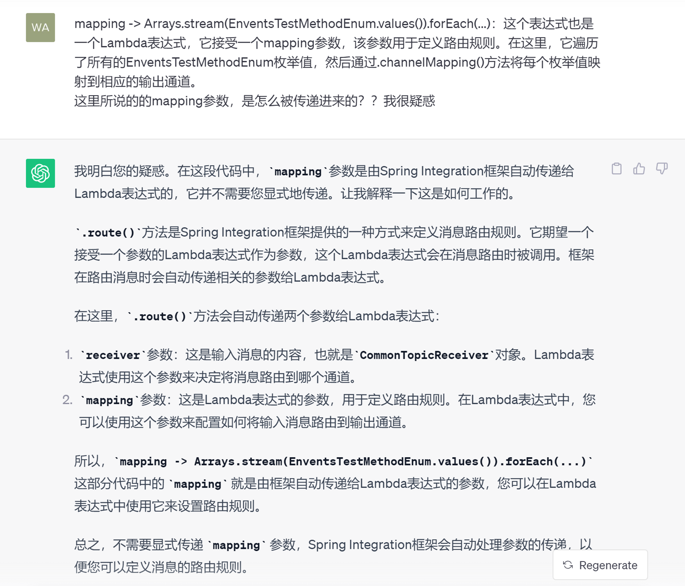
看完这个就大致明白啦，这个参数是 `Spring Integration` 由框架自动传递给Lambda表达式的参数。

从其他博主那找了一个简单案例：`Spring Integration`提供了一个`IntegrationFlow`来定义系统继承流程，而通过`IntegrationFlows`和`IntegrationFlowBuilder`来实现使用Fluent API来定义流程。在`Fulent API`里，分别提供了下面方法来映射`Spring Integration`的端点（EndPoint）。
```bash
    transform() -> Transformer
    filter() -> Filter
    handle() -> ServiceActivator、Adapter、Gateway
    split() -> Splitter
    aggregate() -> Aggregator
    route() -> Router
    bridge() -> Bridge
```
一个简单的流程定义如下：
```java
    @Bean
    public IntegrationFlow demoFlow(){
    		return IntegrationFlows.from("input")  //从Channel  input获取消息
    			.<String,Integer>transform(Integer::parseint) //将消息转换成整数
    			.get();  //获得集成流程并注册为Bean
    }
```
原文链接：<https://blog.csdn.net/qq_40929047/article/details/89569887>

### 4.7、Message Handler

关于 `Message Handler` 我在入站适配器的配置类中，有配置过一个默认的消息处理器（通常用来兜底的）
```java
    /**
     * Define a default channel to handle messages that have no effect.
     *
     * @return
     */
    @Bean
    @ServiceActivator(inputChannel = ChannelName.DEFAULT)
    public MessageHandler defaultInboundHandler() {
        return message -> {
            log.info("The default channel does not handle messages." +
                    "\nTopic: " + message.getHeaders().get(MqttHeaders.RECEIVED_TOPIC) +
                    "\nPayload: " + message.getPayload());
        };
    }

```
上面的`@ServiceActivator(inputChannel = ChannelName.DEFAULT)` 就是表明这是处理从 DEFAULT通道的消息处理方法。

但实际上能够处理消息的并非只有 MessageHandler 类，只要在 xxxxxServiceImpl (已经注册到bean)上标记`@ServiceActivator(inputChannel = ChannelName.xxxx)` 即可处理来自 xxxx 的消息，如果消息不再需要继续传递，那么到这里即是消息的终点啦

比如案例中：


```java

@Service
@Slf4j
public class EnventsTestServiceImpl implements EnventsTestService {

    @Autowired
    private IMessageSenderService messageSenderService;

    @Autowired
    private ObjectMapper mapper;

		@Override
    @ServiceActivator(inputChannel = ChannelName.INBOUND_TASK_TEST2, outputChannel = ChannelName.OUTBOUND_TEST_REPLY)
    public CommonTopicReceiver handleInboundTest1Reply(CommonTopicReceiver receiver, MessageHeaders headers) {
        String dockSn  = receiver.getGateway();
        log.info("handleInboundTest1");
        log.info("dockSn:{}",dockSn);
        log.info("receiver:{}",receiver);
        log.info("headers:{}",headers);
        return receiver;
    }

    @ServiceActivator(inputChannel = ChannelName.OUTBOUND_TEST_REPLY,outputChannel = ChannelName.OUTBOUND)
    @Override
    public void handleOutboundTestReply(CommonTopicReceiver receiver, MessageHeaders headers) {
        log.info("handleOutboundTest");
        log.info("receiver:{}",receiver);
        log.info("headers:{}",headers);
        CommonTopicResponse<Object> build = CommonTopicResponse.builder()
                .tid("receiver.getTid()")
                .bid("receiver.getBid()")
                .method("reply")
                .timestamp(System.currentTimeMillis())
                .data(RequestsReply.success())
                .build();
        messageSenderService.publish("envents_test/response", build);
    }
}
```

### 4.8、订阅主题

不知道看到这里的小伙伴是否还记得基础概念的这张图：


与外界信息来源进行交互的ChannelAdapter（入站适配器）来做的，在谈到入站适配器的配置时，我们也看到了连接也是它来做的，包括初始化时，可以订阅配置文件中配置的主题。


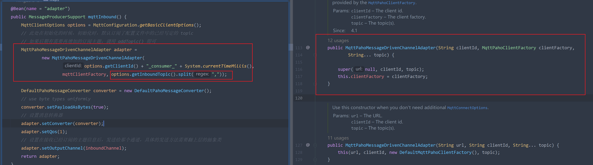
那么自然添加新的主题，也是通过它来完成啦，以下为具体实现，调用则是在上层抽象类 `AbstractMqttMessageDrivenChannelAdapter 中`


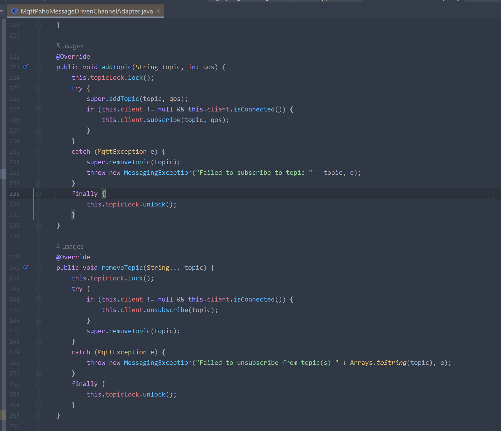

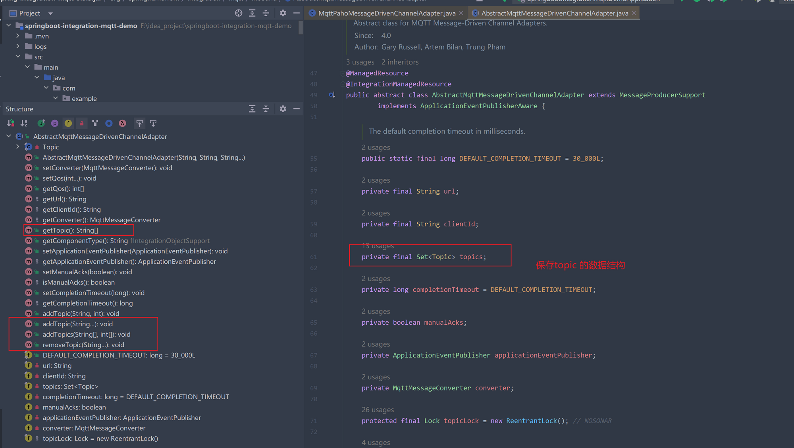
案例中的应用：

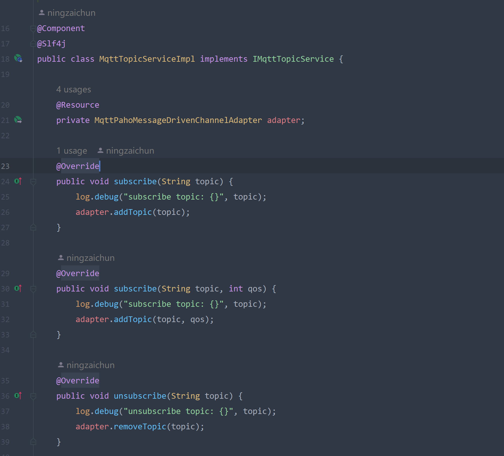
### 4.9、向某个主题发送消息和`@MessagingGateway`注解

坦白说，在我刚看下面这段代码的时候，我也是有些懵的，虽然意思很好猜，就是发送消息，但为啥是这样写，却是完全不懂啦。**不过正是因为这些好奇，最后才组成了这篇文章吧**。
```java
    @Component
    @MessagingGateway(defaultRequestChannel = ChannelName.OUTBOUND)
    public interface IMqttMessageGateway {

        /**
         * Publish a message to a specific topic.
         * @param topic target
         * @param payload   message
         */
        void publish(@Header(MqttHeaders.TOPIC) String topic, byte[] payload);

        /**
         * Use a specific qos to push messages to a specific topic.
         * @param topic     target
         * @param payload   message
         * @param qos   qos
         */
        void publish(@Header(MqttHeaders.TOPIC) String topic, byte[] payload, @Header(MqttHeaders.QOS) int qos);
    }
```
1、简要来说，`Messaging Gateway` 就是在项目中只定义消息端点的接口（使用 Xml 或者 java 注解标识这个接口），接口的具体实现由 spring 容器实现（具体是 `GatewayProxyFactoryBean` 来创建接口实现）。Messaging Gateway 产生的消息将根据消息头中的 request-channel 发送到对应的 channel，并由 reply-channel 中获取响应。

即 `GatewayProxyFactoryBean` 创建动态代理对象，拦截发送Mqtt消息的处理，委托给对应的MessageChannel(消息通道)，此消息通道是通过`@MessagingGateway`注解的`defaultRequestChannel`属性来配置的。 **后面再由订阅这个消息通道的出站适配器进行处理，从而发送到MQTT Broker**。

总的来说就是定义一个 `@MessagingGateway` 修饰的接口，用于消息的发送，`@MessagingGateway` 的 `defaultRequestChannel` 参数用于绑定具体的 `MessageChannel`。

2、对于接口方法中的参数，默认是以 Map 作为消息头而具体的类作为消息的负载（payload），也可以使用 @Header，@Payload 参数注解指定。

3、对于没有参数的方法，这意味着不需要调用者传入而是借由 Messaging Gateway 自动生成。

4、对于消息处理过程中的异常，默认情况下会层层的向上传递，为了捕获相应的异常，可以在接口的方法上添加 throws 关键字定义需要捕获的异常。除此之外，还可以通过指定一个 errorChannel 将错误由指定的消息消费者处理。

案例中的应用：

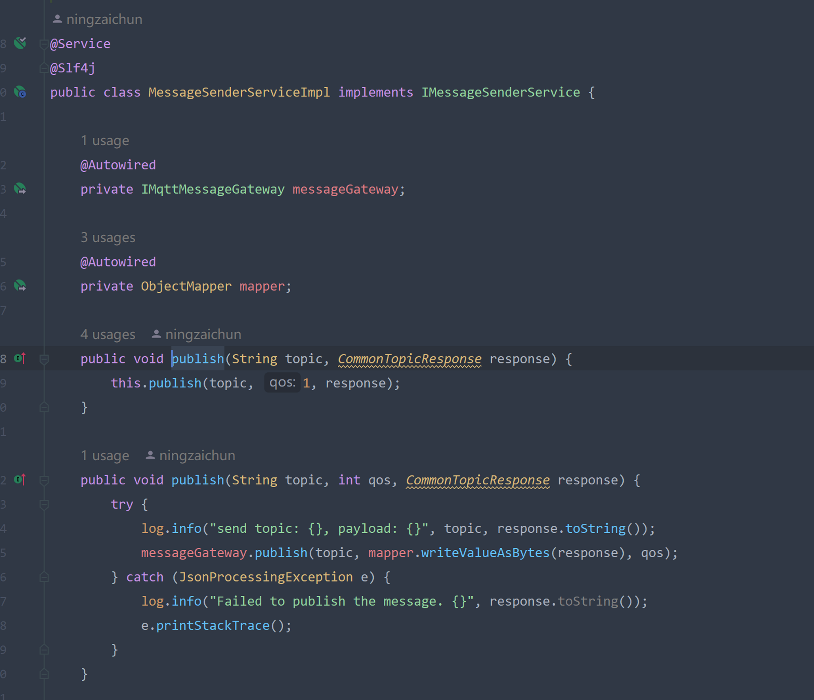
### 4.10、出站适配器

谈到这个，还是把上面的图扒拉下来：


不过这里的出站适配器是由`MqttPahoMessageHandler`实现的。
```java
    @Configuration
    public class MqttOutboundConfiguration {

        @Autowired
        private MqttPahoClientFactory mqttClientFactory;

        /**
         * Clients of outbound message channels.
         * @return
         */
        @Bean
        @ServiceActivator(inputChannel = ChannelName.OUTBOUND)
        public MessageHandler mqttOutbound() {
            MqttPahoMessageHandler messageHandler = new MqttPahoMessageHandler(
                    MqttConfiguration.getBasicClientOptions().getClientId() + "_producer_" + System.currentTimeMillis(),
                    mqttClientFactory);
            DefaultPahoMessageConverter converter = new DefaultPahoMessageConverter();
            // use byte types uniformly
            converter.setPayloadAsBytes(true);

            messageHandler.setAsync(true);
            messageHandler.setDefaultQos(0);
            messageHandler.setConverter(converter);
            return messageHandler;
        }
    }
```
也可以使用 Java DSL 的方式配置出站适配器，如下示例：
```java
    @Bean
    public IntegrationFlow mqttOutboundFlow() {
    	return f -> f.handle(new MqttPahoMessageHandler("tcp://host1:1883", "someMqttClient"));
    }
```
### 4.11、测试效果


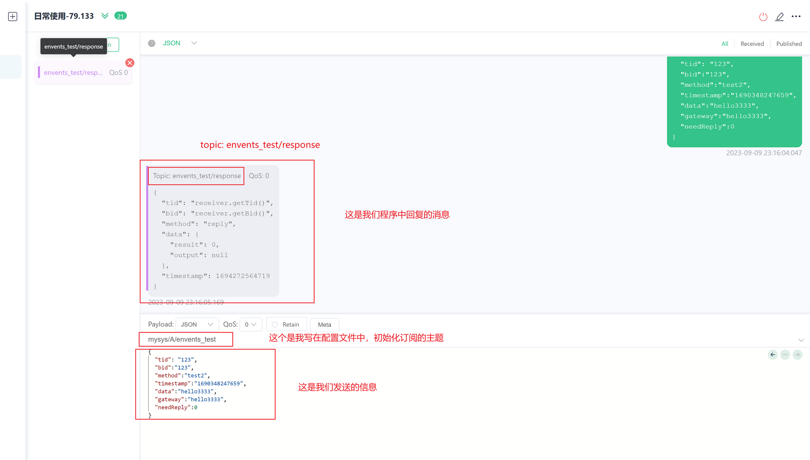
如果启动项目后，要订阅新的主题：
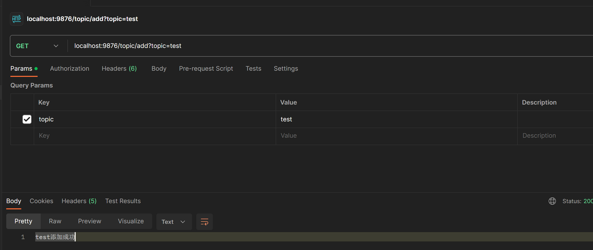
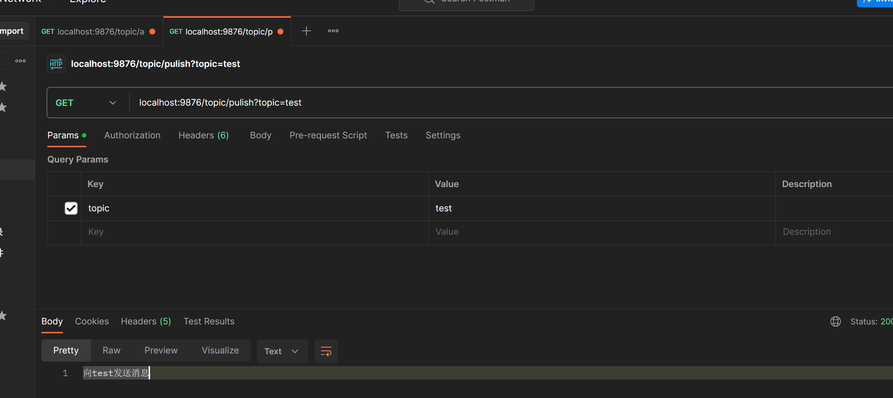

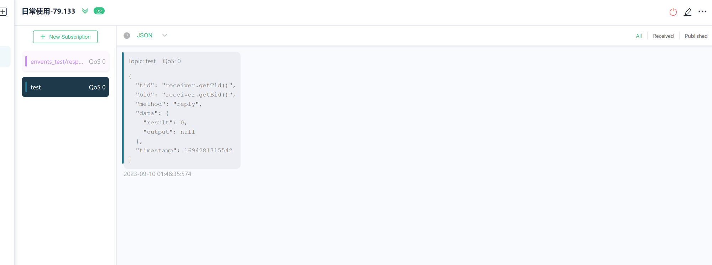
具体代码：
```java
    @RestController
    @RequestMapping("/topic")
    public class MqttTopicController {

        @Autowired
        private IMqttTopicService mqttTopicService;

        @Autowired
        private IMessageSenderService messageSenderService;

        @GetMapping("/add")
        public String add(String topic){
            mqttTopicService.subscribe(topic);
            return topic+"添加成功";
        }

        @GetMapping("/pulish")
        public String pulish(String topic){
            CommonTopicResponse<Object> build = CommonTopicResponse.builder()
                    .tid("receiver.getTid()")
                    .bid("receiver.getBid()")
                    .method("reply")
                    .timestamp(System.currentTimeMillis())
                    .data(RequestsReply.success())
                    .build();
            messageSenderService.publish(topic, build);
            return "向"+topic+"发送消息";
        }
        @GetMapping("/reply")
        public CommonTopicResponse reply(){
            CommonTopicResponse<Object> build = CommonTopicResponse.builder()
                    .tid("receiver.getTid()")
                    .bid("receiver.getBid()")
                    .method("reply")
                    .timestamp(System.currentTimeMillis())
                    .data(RequestsReply.success())
                    .build();
            messageSenderService.publish("test/9876", build);
            return build;
        }
    }
```
只是进行了非常的简单的测试，更多需要使用的，还是需要自己亲自去测试更佳。

## 五、Spring Integration 的优缺点

看到这里，不知道你有感受到了哪些关于 `Spring Integration` 的优缺点呢

**优点**：
1. **解耦**。借助官网的这句话“业务逻辑和集成逻辑之间的关注点分离“，业务逻辑是我们处理消息的部分，集成逻辑是消息传递的部分，在使用Spring Integration 后，消息生产者和消息消费者不再具有强藕性。
3. **模块化：** Spring Integration 使用模块化的设计，你可以根据需要选择性地添加不同的模块，例如消息通道、消息路由、消息转换等，以满足你的集成需求。
5. **多种通信协议支持：** Spring Integration 支持多种通信协议，包括HTTP、FTP、JMS、AMQP、SMTP等，使得你可以轻松地与不同系统进行通信。
7. **与Spring生态集成度高**，因为本身就出自于Spring家族，从集成度而言，比其他第三方框架要好的多。
9. **应对复杂场景更轻松**。可以根据自己的需求定制消息处理器、消息通道和路由规则，以满足复杂的集成场景。

**缺点**：
- **学习成本**。如果是没接触过的朋友，Spring Integration 还是有一定的学习曲线的。
- **过度** 。Spring Integration 确实优点不少，但是如果你的项目并不是十分复杂，那么使用它其实有可能是繁琐和复杂的。
- **复杂**。虽然能更好的应对复杂场景，但是复杂场景下，它的配置也会变得复杂，它的维护和管理也会逐渐变得困难。**这其实是一个系统发展不可避免的一个问题，当你遇上此问题时，那么也是你该进行知识输入的时候啦。**
- **适用于特定场景**。

总的来说，Spring Integration 是一个强大的企业集成框架，可以帮助你解决复杂的集成问题。但在选择使用它之前，你需要考虑你的具体需求、团队的经验和项目的复杂性。如果你的集成需求相对简单，可能有更轻量级的替代方案可供选择。

补充：此处多参考于ChatGPT。

## 参考

1. [EMQX **Docker 部署指南**](https://www.emqx.io/docs/zh/v5/deploy/install-docker.html)
3. [Spring Integration 文档](https://docs.spring.io/spring-integration/docs/5.5.18/reference/html/overview.html#overview-endpoints)
5. [Spring 5 实战](https://potoyang.gitbook.io/spring-in-action-v5/di-9-zhang-ji-cheng-spring/9.1-sheng-ming-jian-dan-de-ji-cheng-liu/9.1.3-shi-yong-spring-integration-de-dsl-pei-zhi)
7. **[spring MessagingGateway 简介](https://zhuanlan.zhihu.com/p/577226216)**
9. **[spring boot + mqtt 物联网开发](https://www.cnblogs.com/haoliyou/p/15157407.html)**
10. ChatGPT

## 最后

这篇更多的是一个学习过程中的记录，代码的实现也是Demo，规范以及实用性仍然是有不足之处，更多的是提供参考，而非直接使用的。如果你有更好的方式，那么不妨在评论区中写下你的想法，还望朋友们不吝赐教。

**也希望读到这里的你，能有所收获吧，下篇博客再见**，**祝你周末愉快**。

~~好像有点不对，周末貌似没太多人上线，那就祝你周一搬砖愉快吧。~~
